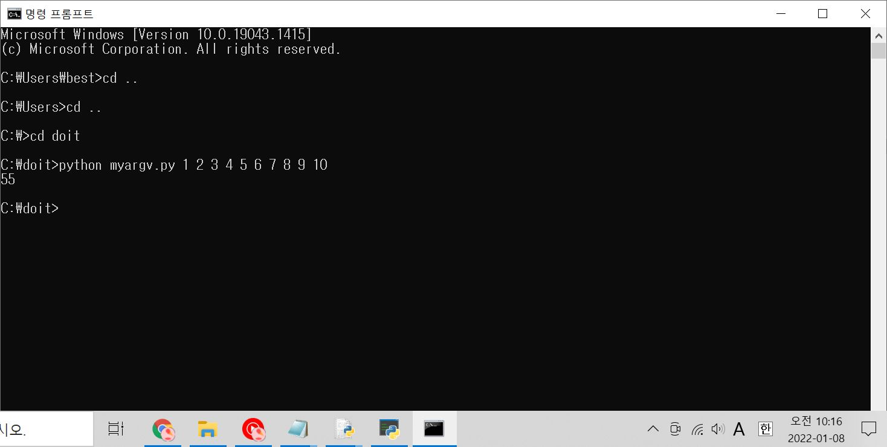

#### 점프투파이썬 5장 연습문제 풀이


##### Q2.

객체 변수 value가 100이상의 값을 가질 수 없는 프로그램

```python
class Calculator:
    def __init__(self):
        self.value = 0
        
	  def add(self, val):
    	self.value += val


class MaxLimitCalculator(Calculator):
    def add(self, val):
		    self.value += val
		    if self.value > 100:
			      self.value = 100
        
cal = MaxLimitCalculator()
cal.add(50)
cal.add(60)
print(cal.value)
```

-Calsulator 클래스의 add함수를 오버라이딩.

-self값이 100이 넘는 경우, if문을 통해 100으로 값을 바꾼다. 

내가 너무 꼬아서 생각을 했다... 


##### Q9.

cmd 창에서 myargv.py 파일을 실행할 때, 입력값을 모두 더하는 프로그램 

```python
# myargv.py

import sys

numbers = sys.argv[1:] # 파일 이름을 제외한 명령 행의 모든 입력
result=0

for number in numbers:
    result += int(number) #문자열을 정수형으로 바꾸어 더한다.

print(result)
```

-sys.argv를 사용할 때 [1:] 슬라이싱을 사용

-for문에서 정수형으로 바꾼 후 result에 더한다.




##### Q13.

6개의 중복 없는 로또 숫자를 생성하는 프로그램

```python
import random

result = []
for i in range(6):
    num = random.randint(1,45) # 난수를 생성하여 num 변수에 저장
    if num not in result: # num 값이 result리스트에 없는 수면
        result.append(num) # result리스트에 num값을 저장
print(result)
```

-난수 값을 임시로 저장할 num변수 필요

-num값이 result 리스트에 없어야 result 리스트에 저장된다.

-random.randint로 정수 난수를 생성하고, append 함수로 값을 대입하기


다양한 함수를 사용하는 연습이 필요할 것 같다.
